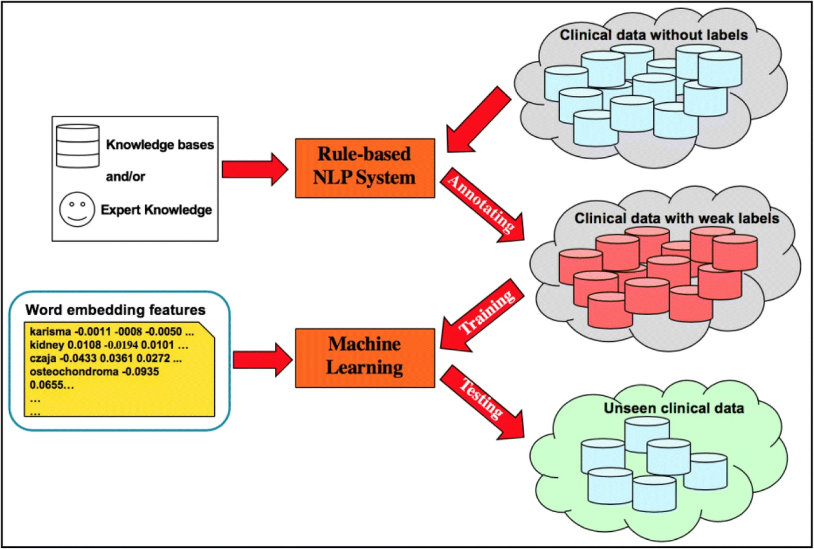

# Data Programming and Weak Supervision
The following section introduces Data Programming and Weak Supervision. The goal is to show technologies that can be used to design a machine teaching system.

## What is Data Programming

Data programming reduces the cost of creating a training set by encoding domain knowledge as heuristics or labeling functions over source data. Labeling functions can be made from regular expressions, keyword lists and dictionaries, knowledge bases, external models, etc. 

For example:
```python
from snorkel.labeling import labeling_function

@labeling_function()
def lf_contains_motion(x):
    # Return a label of MOTION if "motion" in document text, otherwise ABSTAIN
    return MOTION if "motion" in x.text.lower() else ABSTAIN

@labeling_function()
positive_diagnosis = ["suggestive", "positive", "indicative", "suggests", "indicates"]
negative_diagnosis = ["negative"] + ["not " + x for x in positive_diagnosis]
def LF_diagnosis(x):
    disease_start, disease_end = x.disease.get_word_range()
    diagnosis_start, diagnosis_end = x.diagnosis.get_word_range()
    if disease_start < diagnosis_end:
      if x.diagnosis in positive_diagnosis:
        return True
      if x.diagnosis in negative_diagnosis:
        return False
    return None
```

Labeling functions vary in complexity and accessibility. They require **domain expertise** and **programming experience**.

Given a set of labeling functions over a dataset, we can aggregate them to programmatically label our dataset. These functions are not necessarily perfect. In practice, individual labeling functions are weak and noisy supervision signals. But as you'll see in the Snorkel papers, we can still work with this.

## [Understanding Snorkel](https://medium.com/@annalara/understanding-snorkel-5e33351aa43b)

This article provides a brief introduction to Snorkel, data programming, weak supervision, and training on noisy labels. Snorkel is expanded on later in this page.

## Data Programming for Machine Teaching

In the Introduction to Machine Teaching section, we see the goal of Machine Teaching described as finding a training set. The optimal training set has minimum cost and generalization error. We can reduce the cost of creating this training set with interactive Machine Teaching, which considers more intelligent exploration of samples - by considering informativeness and difficulty. With data programming, we can define functions to programmatically label the data.

Data Programming is FAST. We can find an interaction through which the user iteratively explores data and creates/edits labeling functions until the labeling functions sufficiently cover the dataset. Then the system can aggregate these functions and train a model. We can use data science skills (balancing the dataset, data augmentation, cross validation, hyperparameter tuning, model selection, etc.) to help with generalization error. Distribution shift is another problem we'd need to think about.
  
Machine Teaching has also been described as infusing domain expertise or concepts. The knowledge decomposition paper gives us some ideas as to how we can leverage labeling functions to have users teach concepts. Labeling functions can leverage keywords, regex, distant supervision, external models, rules, and heuristics. 

The challenge is to provide the following functionalities:

### An interaction to facilitate data exploration and knowledge decomposition (Machine Teaching)
This could look like the sensemaking loop in knowledge decomposition or any of the algorithms/processes described in this repo (check the papers).

### Labeling function creation for non-technical users. 
This requires:
  - A mapping from types of labeling functions to processes described in the knowledge decomposition paper.
  - An interface which supports the creation of these labeling functions in a technically accessible way. In other words, we need to collect user input on concepts in such a way that we can parse it into labeling functions. eg. "Give me some keywords and the corresponding label."
  - An interface which supports data exploration guidance/feedback on labeling functions.
  - An interface to edit, add, remove labeling functions. 

### Machine learning under the hood. 
This requires:
  - A system that abstracts away the weak supervision and machine learning from the user. In other words, aggregation of labeling functions, evaluation of labeling functions, and model training all happen under the hood, but feedback is provided to the user via the labeling function interface.
  - A system that maps types of models and feature extraction methods to types of problems:
    - e.g. Text classification => DistilBERT, Tfidf + Classifier, etc.
  - A system that handles the data science stuff
    - e.g. data augmentation, balancing the dataset, hyperparameter optimization, cross validation

The following paper shows an example of what we are thinking of (in the medical domain):
[A clinical text classification paradigm using weak supervision and deep representation](https://bmcmedinformdecismak.biomedcentral.com/articles/10.1186/s12911-018-0723-6)



## [Data Programming Systems - Snorkel](https://github.com/simon-benigeri/machine-teaching-literature/blob/main/machine%20teaching%20systems/data%20programming/snorkel.md)

Here you will find more resources on Snorkel and its extensions.

## [Data Programming Systems - Alternatives to Snorkel](https://github.com/simon-benigeri/machine-teaching-literature/blob/main/machine%20teaching%20systems/data%20programming/snorkel_alternatives.md)

We focus on Snorkel because it is the most developed, used, and documented data programming system, but there are alternatives. 
