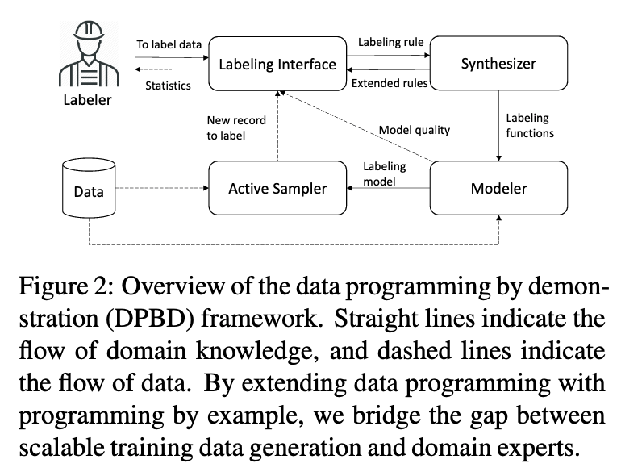
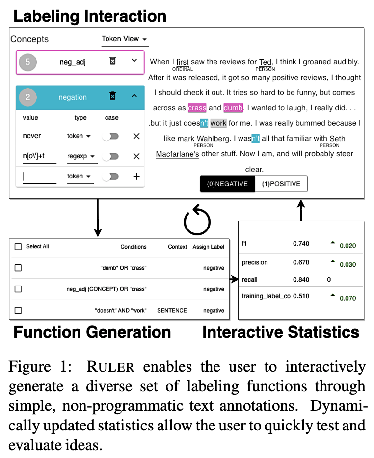

# Alternatives to Snorkel

While Snorkel is heavily mentioned, it is not the only technology or approach to data programming. This page contains examples of alternatives as well as links to research that focuses on improving the Data Programming Interaction.

Some of these papers were in the [Awesome Weak Supervision](https://github.com/JieyuZ2/Awesome-Weak-Supervision) repository. I encourage you to look at this repo yourselves.

## [SKWEAK](https://github.com/NorskRegnesentral/skweak)
Open source python toolkit to programmatically label text, like with Snorkel. Built on top of SpaCy.

Workflow:
- Start: First, you need raw (unlabelled) data from your text domain. skweak is build on top of SpaCy, and operates with Spacy Doc objects, so you first need to convert your documents to Doc objects using SpaCy.
- Step 1: Then, we need to define a range of labelling functions that will take those documents and annotate spans with labels. Those labelling functions can comes from **heuristics**, **gazetteers**, **machine learning models**, etc. See the [documentation](https://github.com/NorskRegnesentral/skweak/wiki) for more details.
- Step 2: Once the labelling functions have been applied to your corpus, you need to aggregate their results in order to obtain a single annotation layer (instead of the multiple, possibly conflicting annotations from the labelling functions). This is done in skweak using a generative model that automatically estimates the relative accuracy and possible confusions of each labelling function.
- Step 3: Finally, based on those aggregated labels, we can train our final model. Step 2 gives us a labelled corpus that (probabilistically) aggregates the outputs of all labelling functions, and you can use this labeled data to estimate any kind of machine learning model. You are free to use whichever model/framework you prefer.

### Comments:
This can be great if you want to leverage domain specific language models or NER models and ontologies. 
In my current role, I need to create a dataset from clinical notes, and most of my heuristics will be keyword based, or will build on top of entities that map to the UMLS ontology.

## [Ruler: Data Programming by Demonstration for Document Labeling](https://aclanthology.org/2020.findings-emnlp.181/)
Data programming reduces the cost of creating a training set by encoding domain knowledge as labeling functions over source data.

It requires:
  1. domain expertise
  2. programming experience - which subject matter experts do not have

Also, generating functions by enumerating rules is not only time consuming but also inherently difficult, even for people with programming experience.

Ruler is an interactive system that synthesizes labeling rules using span-level interactive demonstrations over document examples. Ruler is a first-of-a-kind implementation of data programming by demonstration (DPBD). 

This new framework aims to relieve users from the burden of writing labeling functions, enabling them to focus on higher-level semantic analysis, such as identifying relevant signals for the labeling task. 

### Comments:
I have not tried this so I don't know how well it works, but Snorkel.ai went in a similar direction with their platform. GUIs help reduce the technical barrier to creating labeling functions. Where this differs is that the labeling functions are inferred from demonstrations.

## [INTERACTIVE WEAK SUPERVISION: LEARNING USEFUL HEURISTICS FOR DATA LABELING](https://github.com/benbo/interactive-weak-supervision) 
The goal of this approach is help experts discover good labeling functions (LFs).

## [ACTIVE WEASUL: IMPROVING WEAK SUPERVISION WITH ACTIVE LEARNING](https://github.com/SamanthaBiegel/ActiveWeaSuL)

