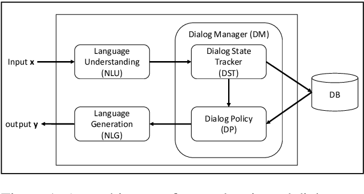
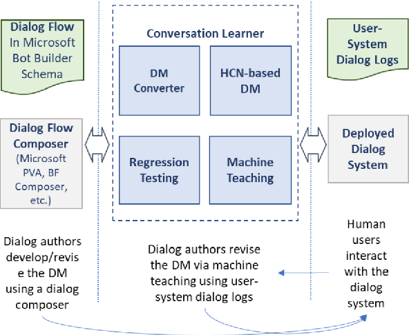
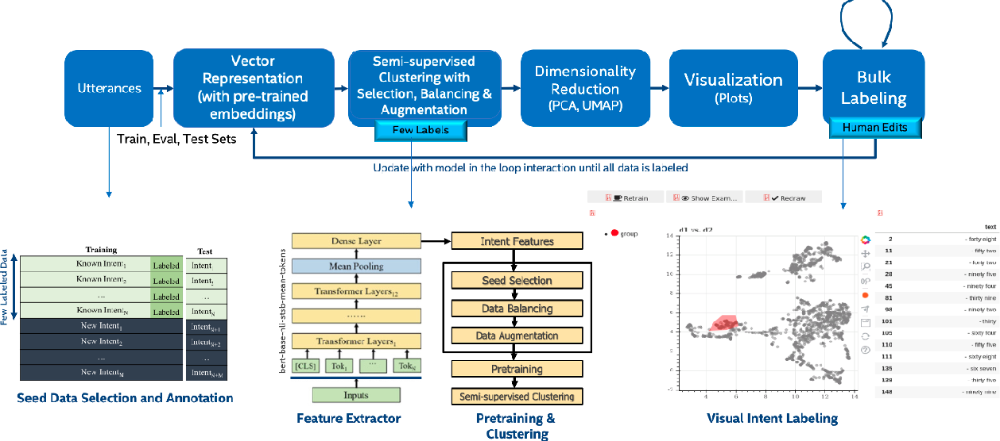

# Existing Machine Teaching Systems
Some notes about existing machine teaching systems. We can inspire ourselves from these to think about building out own.

## [Microsoft - LUIS (Language Understanding)](https://www.luis.ai/)
- Part of the Azure stack. Integrates NLU capabilities into chatbots, apps, and IOT devices.
- Provides language models for intent classification and entity extraction.
  - Users can create app, bot, or device specific dictionaries. These are leveraged by the language models.
- Uses active learning to help with continuous improvement.

## [Microsoft - Project Bonsai](https://docs.microsoft.com/en-us/bonsai/product/)
- Part of the Azure stack. Creates autonomous systems for industrial applications.
- A machine teaching platform that leverages:
  - Instructions from engineers (domain expertise)
  - Simulation (for training)
  - Deep reinforcement learning (for optimal control)
- Some more links:
  - [Autonomous Systems - Project Bonsai - How it Works](https://www.microsoft.com/en-us/ai/autonomous-systems-project-bonsai-how-it-works)
  - [Azure - Project Bonsai](https://azure.microsoft.com/en-us/services/project-bonsai)

## [Microsoft - Conversation Learner – A Machine Teaching Tool for Building Dialog Managers for Task-Oriented Dialog Systems (Shukla, Liden, et al., 2020)](https://arxiv.org/abs/2004.04305)
The industry standard in task-oriented dialog systems help dialog authors define rule-based dialog managers, representing dialog flows. These are interpretable and good for simple scenarios but are too brittle/lack flexibility for complex dialogs.

Typical task oriented dialog system architecture:

Machine-learning based approaches are more flexible, but are not interpretable and require lots of training data.

This paper introduces **Conversation Learner**. It is a machine teaching tool for building dialog managers. It combines the best of both approaches.
  - Dialog authors can create a dialog flow using familiar tools.
  - The dialog flow is converted into a parametric model (e.g., neural networks).
  - Dialog authors can improve the dialog manager (i.e., the parametric model) over time by leveraging user-system dialog logs as training data through a machine teaching interface.

The architecture of Conversation Learner (Top) and the development of DMs using Conversation Learner (Bottom):

## [Intel - Semi-supervised Interactive Intent Labeling (Sahai et al., 2021)](https://arxiv.org/abs/2104.13406)

This paper presents a system to speed up training for intent classification in dialog systems. Developers can in interactively label and augment training data from unlabeled utterance corpora using advanced clustering and visual labeling methods. Some of the interesting ideas are:
  - word embeddings and sentence embeddings (SBERT) for semantic similarity and clustering
  - data augmentation techniques like oversampling to improve clustering
  - an interaction to explore and label data that leverages the feedback that these technologies can provide

## [Machine Teaching for Inverse Reinforcement Learning: Algorithms and Applications (Brown et al., 2018)](https://arxiv.org/abs/1805.07687)

This paper shows how Machine Teaching can make for more effcicient inverse reinforcement learning systems.

Inverse reinforcement learning (IRL) infers a reward function from demonstrations. Given this reward function, an agent learns a policy (a distribution of actions over states) that maximizes cumulative expected rewards. In other words, the agent learns a sequential decision making task.

Machin Teaching can help achieve the minimum set of demonstrations needed to teach a specific sequential decision-making task. The paper covers ideas like "maximally informative demonstrations."

## [Interaction Design for Machine Teaching to Develop AI Tutors (Weitekamp III et al., 2020](https://dl.acm.org/doi/abs/10.1145/3313831.3376226)

Watch this [video](https://www.youtube.com/watch?v=S9Gp2j7I5mU). It's only 30 seconds long.

## [HistomicsML2 - Interactive classification of whole-slide imaging data for cancer researchers](https://www.ncbi.nlm.nih.gov/pmc/articles/PMC8026494/)

HistomicsML2 is an interactive machine learning for whole slide imaging data and provides a web-based user interface and is available as a deployable software container. 

Users select a classifier, the classifier makes predictions, and users correct these predictions. Active learning helps speed up this interaction. That is to say, it takes less annotations/samples to train the model. However, active learning suffers from bias in the training set. I spoke to Lee Cooper and he mentioned that Bayesian Active Learning could be used in futire work.

## [Cambridge Semantics, Parabole.ai - Using Machine Teaching in Text Analysis](https://usc-isi-i2.github.io/KDD2020workshop/papers/KGE1_paper_10.pdf)

This paper is a case study on using Machine Teaching with knowledge graphs. It lacks detail and is pretty shots. I also wonder if they put "teaching" instead of "learning." But the paper makes the case that it is useful to leverage knowledge graphs in combination with key words, phrases, and concepts provided by subject matter experts.
