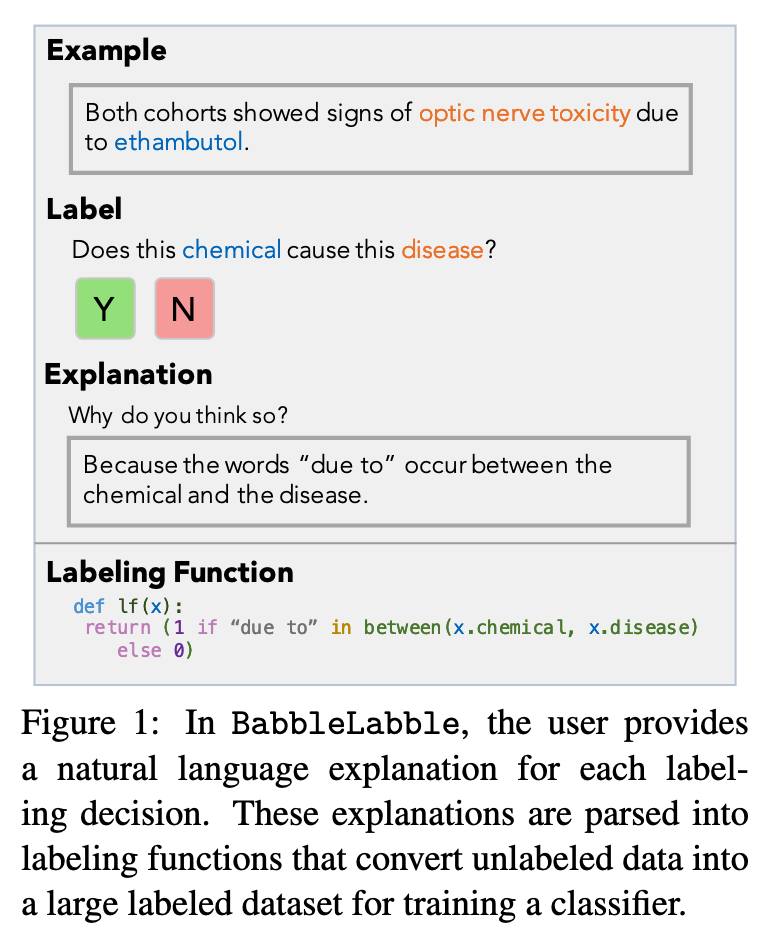
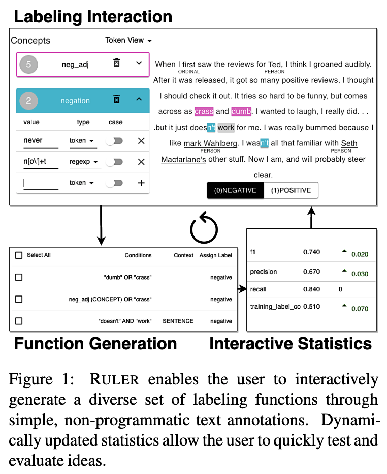
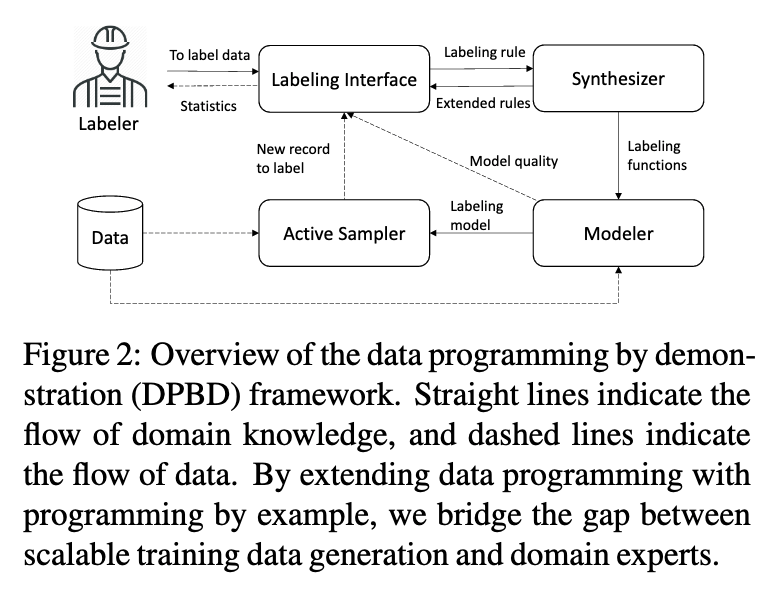
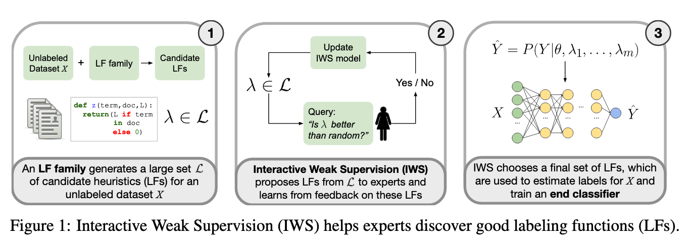

# 🚀 Motion Classification With Snorkel: Final Comments/Future Work

If we are successful in these text classification tasks, we will consider  solutions to help non-technical workers label the data without programming themselves. Solutions include:
1. Function building interfaces, as seen on Snorkel Flow.
2. Distant supervision: leveraging external knowledge bases. 
3. Mapping natural language inputs to labeling functions. We can use the [BabbleLabbleFramework](https://github.com/HazyResearch/babble) to parse Snorkel Labeling Functions

4. Interfaces/systems where users can provide annotations, which are then converted to labeling functions. An example of such a technology is [Ruler: Data Programming by Demonstration for Document Labeling](https://aclanthology.org/2020.findings-emnlp.181/)

We are also interested in optimizations of the interaction between the user and the system. An example is given by [Ruler: Data Programming by Demonstration for Document Labeling](https://aclanthology.org/2020.findings-emnlp.181/) below:

Some other important questions, raised by [Mallinar et al. 2019](https://arxiv.org/pdf/1812.06176.pdf):
1. How do we provide guidance to users to create effective labeling functions? From [Mallinar et al. 2019](https://arxiv.org/pdf/1812.06176.pdf), users desire guidance on how to optimize for precision, coverage, and bias between positive/negative examples in creating functions.
2. How do we support data exploration? Users may be domain experts, but that does not mean they are familiar with the corpus.
3. How do we provide fast feedback and progress tracking? Users desire to see how each query or labeling function impacts the results with immediate feedback. The feedback can help users actively adjust the labeling functions they provided. Systems that require training on many classes stress the need to know when it's time to move on to a diferent class.
4. How do we support evolving classes? (A framework like Snorkel can do this.)

Other questions:
1. How do we minimize the number of samples the user has to see or label?
2. Can we use active learning, uncertainty sampling, or other techniques to surface *valuable examples*? [Active WeaSuL: Improving Weak Supervision with Active Learning](https://github.com/SamanthaBiegel/ActiveWeaSuL) provides some ideas on this.
3. Can a system learn or define heuristics for data labeling? For instance in [Interactive Weak Supervision: Learning Useful Heuristics for Data Labeling](https://github.com/benbo/interactive-weak-supervision)

Note: For 3. how do we come up with the LF function family? Can it come from [Reef](https://github.com/HazyResearch/reef)? 
